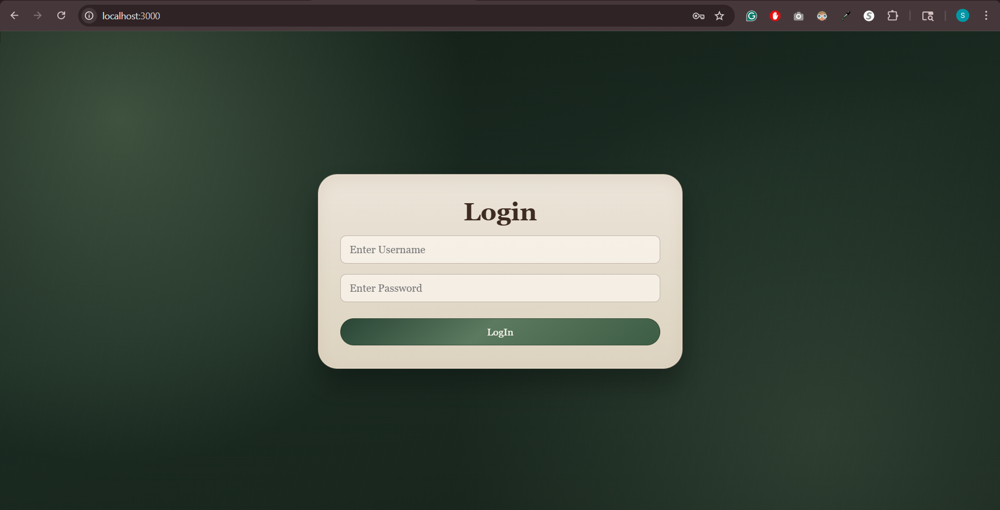
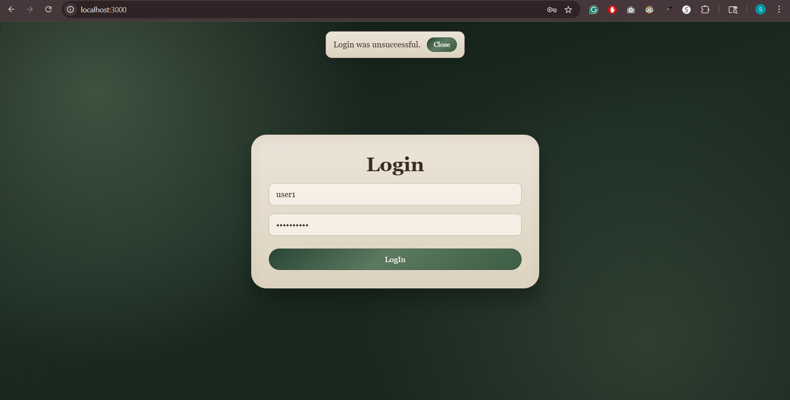
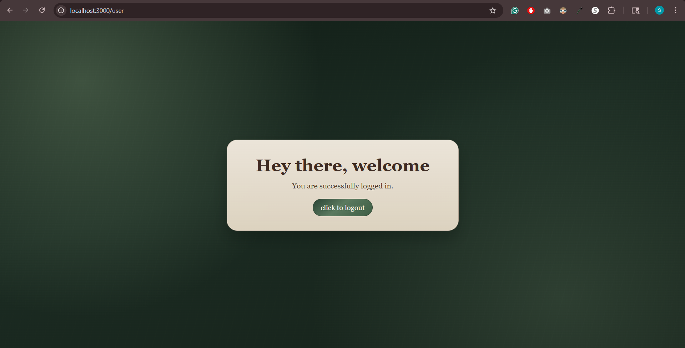

# COSC-480 Website

Node.js + Express project with:
- Session-based login demo (`/`, `/user`, `/logout`)
- Login credentials backed by MySQL (`users` table)
- Static HTML/CSS practice page (`/lecture0-exercises`)

## Tech Stack
- Node.js
- Express
- express-session
- cookie-parser
- dotenv
- mysql2

## Project Structure
- `server.js`: Main app on port `3000` (DB-backed login + sessions)
- `app.js`: Session tutorial app on port `4000`
- `db.js`: MySQL connection and user auth helpers
- `views/index.html`: Login form
- `views/user.html`: Logged-in user page
- `views/app.css`: Login form styles
- `.env.example`: Environment variable template

## Setup
1. Install dependencies:
```bash
npm install
```

2. Create your local env file:
- Duplicate `.env.example` to `.env`
- Fill in your database values and session/auth values

Example values are documented in `.env.example`.

## Run
- Main app (port 3000):
```bash
npm start
```
This entrypoint uses MySQL-backed credentials for login and keeps session state with `express-session`.

- Session tutorial app (port 4000):
```bash
npm run start:session
```
This entrypoint is focused on the tutorial session/login flow.

## Default Routes (main app)
- `GET /` login page (or welcome if logged in)
- `POST /user` login submit
- `GET /user` logged-in page
- `GET /logout` logout and clear session
- `GET /lecture0-exercises` static HTML exercise page

## Screenshots
### Login page


### Failed login state


### Successful login state


## Environment Variables
Required for database-backed features:
- `DB_HOST`
- `DB_PORT`
- `DB_USER`
- `DB_PASSWORD`
- `DB_NAME`

Session/auth variables:
- `LOGIN_USERNAME` (seed user inserted on startup if missing)
- `LOGIN_PASSWORD` (seed password for that user)
- `SESSION_SECRET`

## Security Notes
- Do not commit `.env` (already ignored by `.gitignore`).
- Rotate any password that was ever exposed in logs or screenshots.
- Use a long, random `SESSION_SECRET` in real deployments.

## Troubleshooting
- If `npm start` fails with DB errors, verify `.env` values and that MySQL is running.
- If login fails, confirm a matching record exists in MySQL `users` table.
- If port `3000` is busy, stop the other process using it and restart.

## Optional: Verify Database Quickly
If login works, your DB setup is likely fine. If you want to verify manually:

In MySQL Workbench:
- Open the `Schemas` tab (bottom-left), refresh, and expand `credentials`.
- Open table `users` and run `SELECT * FROM users;`.

In terminal:
```bash
mysql -u root -p
```
Then run:
```sql
USE credentials;
SHOW TABLES;
DESCRIBE users;
SELECT * FROM users;
```
