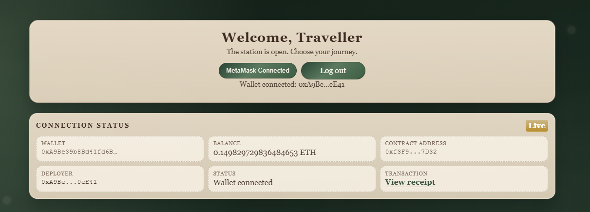
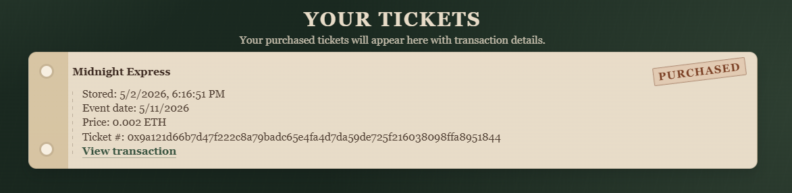
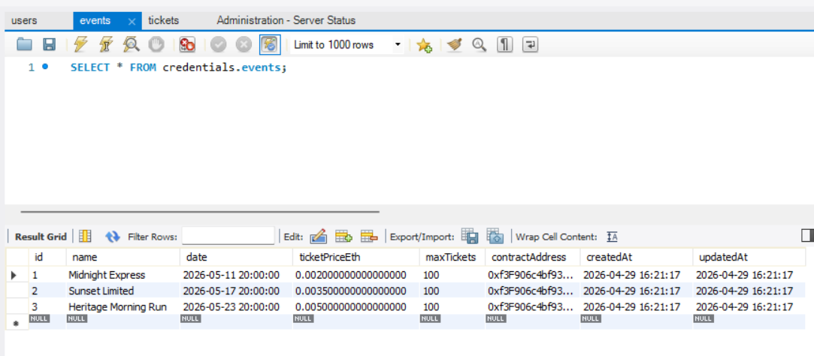

# COSC-480 Capstone — Vintage Train Station Ticketing App

A full-stack web app built with Node.js, Express, MySQL, and Ethereum smart contracts.
Users log in with session-based auth, connect their MetaMask wallet, and purchase
event tickets on the Sepolia testnet. Purchases are recorded on-chain and saved to
a MySQL database.

## Tech Stack

- Node.js + Express
- express-session + cookie-parser
- Sequelize ORM + MySQL
- Hardhat + Solidity (Sepolia testnet)
- ethers.js (v5, via CDN)
- Vanilla HTML + CSS

## Project Structure

- `server.js` — Main app on port 3000
- `db.js` — Sequelize auth helpers
- `models/` — Sequelize models (User, Event, Ticket)
- `services/sequelizeQueries.js` — DB query helpers
- `migrations/` — Sequelize migration files
- `contracts/` — Hardhat project with TicketSale.sol
- `public/` — Frontend HTML, CSS, and client-side JS
- `.env.example` — Environment variable template

## Setup

1. Install root dependencies:

```
npm install
```

2. Install contract dependencies:

```
cd contracts && npm install && cd ..
```

3. Copy `.env.example` to `.env` and fill in your values.

4. Run database migrations:

```
npm run db:migrate
```

## Run

```
npm start
```

App runs at http://localhost:3000

## Routes

### Auth
- `GET /` — Login page
- `POST /user` — Login submit
- `GET /register` — Registration page
- `POST /register` — Register submit
- `GET /logout` — Logout and clear session

### Ticketing (requires login)
- `GET /user` — Main dashboard with MetaMask connect and ticket purchase
- `GET /events` — Browse available events
- `GET /events/:id` — Event detail page
- `GET /my-tickets` — View purchased tickets

### API
- `GET /api/events` — List all events
- `GET /api/events/:id` — Get single event
- `GET /api/tickets` — Get tickets for logged-in user
- `POST /api/tickets` — Save a ticket purchase after blockchain confirmation

## Smart Contract

Deployed on Sepolia testnet. The TicketSale.sol contract handles:
- Ticket purchases via ETH payment
- Unique ticket ID generation per buyer
- On-chain ticket ownership tracking

To deploy:

```
npm run deploy:sepolia
```

## Environment Variables

### Database
- `DB_HOST`
- `DB_PORT`
- `DB_USER`
- `DB_PASSWORD`
- `DB_NAME`

### Session and Auth
- `SESSION_SECRET`
- `LOGIN_USERNAME`
- `LOGIN_PASSWORD`

### Blockchain
- `SEPOLIA_RPC_URL`
- `PRIVATE_KEY`

## Security Notes

- Do not commit `.env` — already ignored by `.gitignore`
- Passwords are currently stored as plain text — bcrypt hashing is a planned improvement
- Keep your `PRIVATE_KEY` out of source control at all times

## Screenshots








